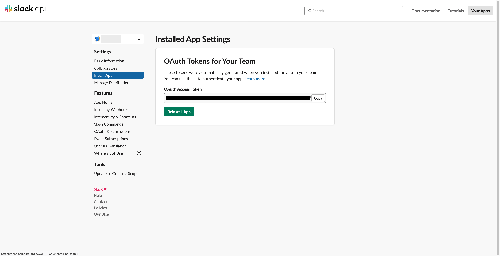

# Getting Started

A short tutorial on getting started with Slack API.

See https://api.slack.com/ for more info

# Make a Slack App

1. Goto https://api.slack.com/apps, and click on `Create New App`. Follow the
prompts to generate an app associated with one of your workspaces

# Configure Permissions

1. Once you're in your app's dashboard, click on `OAuth & Permissions`

2. Scroll down to the `Scopes` section, and add all the permissions required
for your usecase. Slacks Web API lists required permissions in each endpoint's
documentation

# Get Your Access Token

Slack automatically installs your app the workspace you specified during your
app's creation, and will complete the OAuth flow required to provide you with
a token.

1. Goto `Install App` and grab the token Slack provides to start using the API

